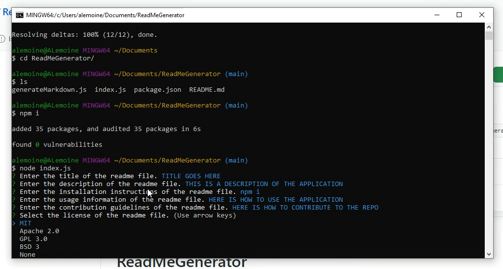

# ReadMeGenerator
An app that generates a readme file from user inputs.

## Description
This application will generate a formatted readme file for the user after prompting a couple of questions. In order for this application to run ensure Node.js is installed on your machine. After answering the prompts a readme file is generate under the name newReadme.md. Once the file is created you can edit the name, and any information in the body as needed.

## Video walkthrough
[](https://youtu.be/wrH6rT1zzfg)

## Installation

After cloning this repository use the following command to install all dependencies:
```bash
npm i
```

## Usage Information

The application will be invoked by using the following command:

```bash
node index.js
```
## License
Copyright 2020 Amanda LeMoine

Permission is hereby granted, free of charge, to any person obtaining a copy of this software and associated documentation files (the "Software"), to deal in the Software without restriction, including without limitation the rights to use, copy, modify, merge, publish, distribute, sublicense, and/or sell copies of the Software, and to permit persons to whom the Software is furnished to do so, subject to the following conditions:

The above copyright notice and this permission notice shall be included in all copies or substantial portions of the Software.

THE SOFTWARE IS PROVIDED "AS IS", WITHOUT WARRANTY OF ANY KIND, EXPRESS OR IMPLIED, INCLUDING BUT NOT LIMITED TO THE WARRANTIES OF MERCHANTABILITY, FITNESS FOR A PARTICULAR PURPOSE AND NONINFRINGEMENT. IN NO EVENT SHALL THE AUTHORS OR COPYRIGHT HOLDERS BE LIABLE FOR ANY CLAIM, DAMAGES OR OTHER LIABILITY, WHETHER IN AN ACTION OF CONTRACT, TORT OR OTHERWISE, ARISING FROM, OUT OF OR IN CONNECTION WITH THE SOFTWARE OR THE USE OR OTHER DEALINGS IN THE SOFTWARE.